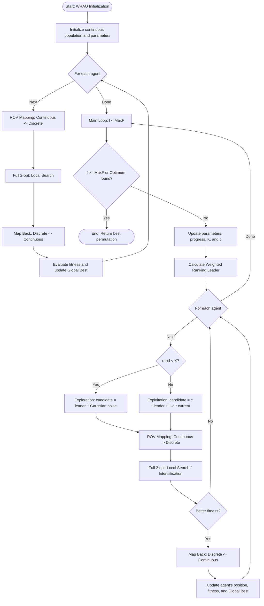

# Technical Project Documentation: Hybrid Artemisinin Optimizer (AO) Algorithms for the QAP Problem

---

## 1. Project Goal

The primary goal of this project is the implementation, adaptation, and advanced evaluation of a nature-inspired metaheuristic – the **Artemisinin Optimizer (AO)** – for solving discrete combinatorial problems, with a specific focus on the **Quadratic Assignment Problem (QAP)**.

The classic AO algorithm is designed for global optimization in continuous search spaces $\mathbb{R}^n$. This implementation focuses on transforming the mathematical mechanisms of this algorithm to operate in the discrete (permutation) domain using **Rank Order Value (ROV)** encoding and decoding strategies.

### Specific Objectives:
1. **Implementation of three AO variants:** Standard Hybrid AO, Weighted Leader AO (WRAO), and a version with elite structure injection at the genetic level (PMX).
2. **Hybridization of exploration and exploitation:** Combining the global search capabilities of AO with a deterministic local search strategy (*2-opt*).
3. **Comparative analysis:** Benchmarking the stability, convergence, and temporal efficiency of the implemented algorithms based on difficult instances from the **QAPLIB** library.

---

## 2. Variable Definitions and Mathematical Apparatus

To ensure full clarity, standardized mathematical notation and corresponding programming variables are used throughout the documentation and algorithm descriptions:

* $n$ (`n_dim` / `D`) – Problem dimension (number of objects and number of available locations).
* $A$ (`flow_matrix`) – Flow matrix of size $n \times n$.
* $B$ (`distance_matrix`) – Distance matrix of size $n \times n$.
* $\pi$ (`permutation`) – Discrete permutation vector.
* $X_i$ (`population[i]`) – Continuous position vector.
* $N$ (`pop_size`) – Total number of search agents.
* $MaxF$ (`max_f`) – Maximum computational budget.
* $f$ (`self.f`) – Current counter of executed cost function evaluations.
* $t$ – Current algorithm iteration.
* $T$ – Maximum intended number of iterations.

---

## 3. Mathematical Analysis and Software Architecture

### 3.1. Universal Utility Functions and Optimizations (Numba Core)

#### 1. Continuous-to-Discrete Mapping: `rov_mapping_numba(continuous_vector)`

$$
\pi = \text{argsort}(X_i)
$$

#### 2. QAP Objective Function Calculation

$$
f(\pi) = \sum_{i=1}^{n} \sum_{j=1}^{n} A_{i,j} \cdot B_{\pi[i], \pi[j]}
$$

#### 3. Reverse Mapping

$$
X_{i, \pi[k]} = -1.0 + \frac{2.0 \cdot k}{n - 1}
$$

#### 4. Local Search Algorithm

$$
f(\pi') < f(\pi)
$$

Stopping condition:

$$
\text{current\_f} \ge \text{max\_f}
$$

### 3.2. Implementation 1: Standard Artemisinin Optimizer (AO)

#### Dynamic Adaptive Parameters

$$
K = 1.0 - \left(\frac{f}{MaxF}\right)^2
$$

$$
c = 2.0 \cdot \left(1.0 - \frac{f}{MaxF}\right)
$$

#### Mathematical Position Update Model

**Phase 1: Shaking**

$$
X_{i,d}^{t+1} = X_{rand,d}^{t} + \mathcal{N}(0, 1) \cdot \left(X_{rand,d}^{t} - X_{i,d}^{t}\right)
$$

**Phase 2: Move towards leader**

$$
X_{i,d}^{t+1} = X_{i,d}^{t} + c \cdot r_3 \cdot \left(X_{best,d}^{t} - X_{i,d}^{t}\right)
$$

### Block Diagram


### 3.3. Implementation 2: Weighted Artemisinin Optimizer (WRAO)

$$
w_m = M - m + 1
$$

$$
X_{weighted,d} =
\frac{\sum_{m=1}^{M} w_m \cdot X_{m,d}}
{\sum_{m=1}^{M} w_m}
$$

$$
X_{i,d}^{t+1} =
X_{i,d}^{t} + c \cdot r_3 \cdot (X_{weighted,d} - X_{i,d}^{t})
$$

### Block Diagram



### 3.4. Implementation 3: AO with Elite Injection (PMX)

#### Hamming Distance

$$
D_H(\pi_1, \pi_2) =
\sum_{k=1}^{n} \mathbb{I}(\pi_1[k] \neq \pi_2[k])
$$

#### Elite Injection Mechanism

$$
\text{injection\_size} =
\max\left(1,\lfloor \text{injection\_rate} \cdot D_H(\pi_i,\pi_{best}) \rfloor\right)
$$

### Block Diagram


---

## 4. Software and Usage Instructions

### Project Module Structure

* `main.py` – Experiment coordinator.
* `benchmark.py` – Statistical module.
* `data_loader.py` – Input file parser.

### Implementation and Execution Guide

```bash
pip install numpy numba pandas matplotlib
```

```bash
python main.py
```

---

## 5. Empirical Tests and Experimental Results

The quality of the final solution fit is represented by the GAP metric:

$$
\text{GAP} =
\frac{\text{Best\_Score} - \text{Optimum}}
{\text{Optimum}}
\cdot 100\%
$$
