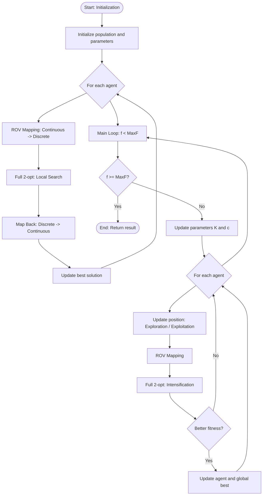

# Technical Project Documentation: Hybrid Artemisinin Optimizer (AO) Algorithms for the QAP Problem

---

## 1. Project Goal

The primary goal of this project is the implementation, adaptation, and advanced evaluation of a nature-inspired metaheuristic – the **Artemisinin Optimizer (AO)** – for solving discrete combinatorial problems, with a specific focus on the **Quadratic Assignment Problem (QAP)**.

The classic AO algorithm is designed for global optimization in continuous search spaces $\mathbb{R}^n$. This implementation focuses on transforming the mathematical mechanisms of this algorithm to operate in the discrete (permutation) domain using **Rank Order Value (ROV)** encoding and decoding strategies.

### Specific Objectives:
1. **Implementation of three AO variants:** Standard Hybrid AO, Weighted Leader AO (WRAO), and a version with elite structure injection at the genetic level (PMX).
2. **Hybridization of exploration and exploitation:** Combining the global search capabilities of AO with a deterministic local search strategy (*2-opt*).
3. **Comparative analysis:** Benchmarking the stability, convergence, and temporal efficiency of the implemented algorithms based on difficult instances from the **QAPLIB** library.

---

## 2. Variable Definitions and Mathematical Apparatus

To ensure full clarity, standardized mathematical notation and corresponding programming variables are used throughout the documentation and algorithm descriptions:

* $n$ (`n_dim` / `D`) – Problem dimension (number of objects and number of available locations).
* $A$ (`flow_matrix`) – Flow matrix of size $n \times n$. Element $A_{i,j}$ defines the flow intensity between object $i$ and object $j$.
* $B$ (`distance_matrix`) – Distance matrix of size $n \times n$. Element $B_{k,l}$ defines the physical distance between location $k$ and location $l$.
* $\pi$ (`permutation`) – Discrete permutation vector (QAP solution) of length $n$, where $\pi[i] = k$ denotes the assignment of object $i$ to location $k$.
* $X_i$ (`population[i]`) – Continuous position vector of the $i$-th population agent in the search space. $X_{i,d} \in [-1, 1]$ represents the coordinate in dimension $d$.
* $N$ (`pop_size`) – Total number of search agents (population size).
* $MaxF$ (`max_f`) – Maximum computational budget defined as the number of allowed objective function evaluations.
* $f$ (`self.f`) – Current counter of executed cost function evaluations.
* $t$ – Current algorithm iteration.
* $T$ – Maximum intended number of iterations.

---

## 3. Mathematical Analysis and Software Architecture

### 3.1. Universal Utility Functions and Optimizations (Numba Core)
All critical mathematical and algorithmic operations have been delegated to functions compiled in JIT mode (`@njit(cache=True)`) using the Numba library. This allows for performance close to C.

#### 1. Continuous-to-Discrete Mapping: `rov_mapping_numba(continuous_vector)`
Transforms a continuous vector $X_i \in \mathbb{R}^n$ into a valid combinatorial permutation $\pi$. It assigns ranks (indices) to the vector elements based on their sorted values:
$$\pi = \text{argsort}(X_i)$$

#### 2. QAP Objective Function Calculation: `calculate_qap_fitness_numba(A, B, permutation)`
Determines the total assignment cost based on the Frobenius product of the input matrices:
$$f(\pi) = \sum_{i=1}^{n} \sum_{j=1}^{n} A_{i,j} \cdot B_{\pi[i], \pi[j]}$$

#### 3. Reverse Mapping: `map_back_numba(permutation)`
Following local optimization operations, it is necessary to synchronize the continuous position $X_i$ with the improved permutation $\pi$. The transformation maps element positions to evenly distributed values in the range $[-1, 1]$:
$$X_{i, \pi[k]} = -1.0 + \frac{2.0 \cdot k}{n - 1}, \quad \text{for } k = 0, 1, \dots, n-1$$

#### 4. Local Search Algorithm: `full_2opt_numba(permutation, A, B, current_f, max_f)`
A local search algorithm with a *first-improvement* criterion. It generates the solution neighborhood through systematic pairwise swaps. 

For each pair $(i, j)$, where $1 \le i < j \le n$, a candidate permutation $\pi'$ is constructed by swapping assignments $\pi[i]$ and $\pi[j]$. The change is accepted immediately if:
$$f(\pi') < f(\pi)$$
The process repeats cyclically until no improvement is found in a full pass (local minimum reached) or $current\_f \ge max\_f$.

---

### 3.2. Implementation 1: Standard Artemisinin Optimizer (AO)
*Source file: `ao_algorithm.py`*

The AO algorithm relies on dynamically switching between a shaking phase (global exploration) and a leader-following phase (exploitation).

#### Dynamic Adaptive Parameters:
In each iteration, two key parameters controlling the movement trajectory are determined:
1. **Component Mutation Probability ($K$):**
   $$K = 1.0 - \left(\frac{f}{MaxF}\right)^2$$
2. **Convergence Step Coefficient ($c$):**
   $$c = 2.0 \cdot \left(1.0 - \frac{f}{MaxF}\right)$$

#### Mathematical Position Update Model:
For each agent $i$ in the population, a value $r_1 \in [0, 1]$ is sampled. The movement strategy choice depends on the evaluation counter state:

* **Phase 1: Shaking (When $r_1 > 0.5$):**
    For each dimension $d \in \{1, \dots, n\}$, if a random value $r_2 < K$, the agent's position is dispersed around a random individual from the population ($X_{rand}$) using a normal distribution $\mathcal{N}(0,1)$:
    $$X_{i,d}^{t+1} = X_{rand,d}^{t} + \mathcal{N}(0, 1) \cdot \left(X_{rand,d}^{t} - X_{i,d}^{t}\right)$$

* **Phase 2: Move towards leader (When $r_1 \le 0.5$):**
    The agent moves toward the current best global solution ($X_{best}$):
    $$X_{i,d}^{t+1} = X_{i,d}^{t} + c \cdot r_3 \cdot \left(X_{best,d}^{t} - X_{i,d}^{t}\right)$$
    where $r_3 \in [0, 1]$ is a uniform random variable.

# Block schemat:



### 3.3. Implementation 2: Weighted Artemisinin Optimizer (WRAO)
*Source file: `wrao_algorithm.py`*

The WRAO variant modifies the second phase. Instead of unambiguous attraction to a single point $X_{best}$, agents move toward a virtual center of gravity determined by the population elite.

#### Mathematical Model for Determining the Weighted Leader:
1. The population is sorted in ascending order by cost function values.
2. An elite subpopulation of size $M = \lceil \text{ranking\_portion} \cdot N \rceil$ is selected.
3. For each selected individual $m \in \{1, \dots, M\}$, a weight $w_m$ is determined based on the ranking position (lower cost, higher weight):
   $$w_m = M - m + 1$$
4. The virtual position of the weighted leader $X_{weighted}$ in each dimension $d$ is calculated as:
   $$X_{weighted, d} = \frac{\sum_{m=1}^{M} w_m \cdot X_{m, d}}{\sum_{m=1}^{M} w_m}$$

In the Phase 2 movement equation, the $X_{best}$ vector is replaced by the consolidated $X_{weighted}$ vector:
$$X_{i,d}^{t+1} = X_{i,d}^{t} + c \cdot r_3 \cdot \left(X_{weighted,d} - X_{i,d}^{t}\right)$$

---

### 3.4. Implementation 3: AO with Elite Injection (PMX)
*Source file: `ao_algorithm_pmx.py`*

This variant shifts some operations directly to discrete structures. The injection of leader genetic code fragments occurs with a frequency defined by the `injection_period` parameter.

#### 1. Hamming Distance: `hamming_distance_numba(p1, p2)`
A distance measure between two discrete solutions (permutations):
$$D_H(\pi_1, \pi_2) = \sum_{k=1}^{n} \mathbb{I}(\pi_1[k] \neq \pi_2[k])$$
where $\mathbb{I}$ is the indicator function.

#### 2. Elite Injection Mechanism: `elite_injection_numba`
The size of genetic injection is a function of the Hamming distance from the leader:
$$\text{injection\_size} = \max\left(1, \lfloor \text{injection\_rate} \cdot D_H(\pi_i, \pi_{best}) \rfloor\right)$$

The injection operator builds a new child solution $\pi^{new}$ for the base agent $\pi_i$ using the genes of the leader $\pi_{best}$.

---

## 4. Software and Usage Instructions

### Project Module Structure
* `main.py` – Experiment coordinator.
* `benchmark.py` – Statistical module.
* `data_loader.py` – Input file parser.

### Implementation and Execution Guide
1. Place source files in a single working directory.
2. Create a `Scenarios/` folder and upload instance files (e.g., `bur26f.dat` and `bur26f.sln`).
3. Install dependencies:
   ```bash
   pip install numpy numba pandas matplotlib
4. Execute
   ```bash
   python main.py
5. Go to folder `Result/bur26f/`, to see the performance raport (`final_report.txt`)


## 5. Empirical Tests and Experimental Results

The quality of the final solution fit is represented by the GAP metric:

$$\text{GAP} = \frac{\text{Best\_Score} - \text{Optimum}}{\text{Optimum}} \cdot 100\%$$
