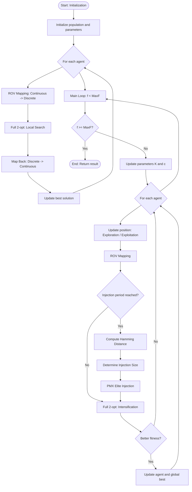

# Technical Project Documentation: Hybrid Artemisinin Optimizer (AO) Algorithms for the QAP Problem

---

## 1. Project Goal

The primary goal of this project is the implementation, adaptation, and advanced evaluation of a nature-inspired metaheuristic – the **Artemisinin Optimizer (AO)** – for solving discrete combinatorial problems, with a specific focus on the **Quadratic Assignment Problem (QAP)**.

The classic AO algorithm is designed for global optimization in continuous search spaces $\mathbb{R}^n$. This implementation focuses on transforming the mathematical mechanisms of this algorithm to operate in the discrete (permutation) domain using **Rank Order Value (ROV)** encoding and decoding strategies.

### Specific Objectives:
1. **Implementation of three AO variants:** Standard Hybrid AO, Weighted Leader AO (WRAO), and a version with elite structure injection at the genetic level (PMX).
2. **Hybridization of exploration and exploitation:** Combining the global search capabilities of AO with a deterministic local search strategy (*2-opt*).
3. **Comparative analysis:** Benchmarking the stability, convergence, and temporal efficiency of the implemented algorithms based on difficult instances from the **QAPLIB** library.

---

## 2. Variable Definitions and Mathematical Apparatus

To ensure full clarity, standardized mathematical notation and corresponding programming variables are used throughout the documentation and algorithm descriptions:

* $n$ (`n_dim` / `D`) – Problem dimension (number of objects and number of available locations).
* $A$ (`flow_matrix`) – Flow matrix of size $n \times n$.
* $B$ (`distance_matrix`) – Distance matrix of size $n \times n$.
* $\pi$ (`permutation`) – Discrete permutation vector.
* $X_i$ (`population[i]`) – Continuous position vector.
* $N$ (`pop_size`) – Total number of search agents.
* $MaxF$ (`max_f`) – Maximum computational budget.
* $f$ (`self.f`) – Current counter of executed cost function evaluations.
* $t$ – Current algorithm iteration.
* $T$ – Maximum intended number of iterations.

---

## 3. Mathematical Analysis and Software Architecture

### 3.1. Universal Utility Functions and Optimizations (Numba Core)

#### 1. Continuous-to-Discrete Mapping: `rov_mapping_numba(continuous_vector)`

$$
\pi = \text{argsort}(X_i)
$$

#### 2. QAP Objective Function Calculation

$$
f(\pi) = \sum_{i=1}^{n} \sum_{j=1}^{n} A_{i,j} \cdot B_{\pi[i], \pi[j]}
$$

#### 3. Reverse Mapping

$$
X_{i, \pi[k]} = -1.0 + \frac{2.0 \cdot k}{n - 1}
$$

#### 4. Local Search Algorithm

$$
f(\pi') < f(\pi)
$$

Stopping condition:

$$
\text{current\_f} \ge \text{max\_f}
$$

### 3.2. Implementation 1: Standard Artemisinin Optimizer (AO)

#### Dynamic Adaptive Parameters

$$
K = 1.0 - \left(\frac{f}{MaxF}\right)^2
$$

$$
c = 2.0 \cdot \left(1.0 - \frac{f}{MaxF}\right)
$$

#### Mathematical Position Update Model

**Phase 1: Shaking**

$$
X_{i,d}^{t+1} = X_{rand,d}^{t} + \mathcal{N}(0, 1) \cdot \left(X_{rand,d}^{t} - X_{i,d}^{t}\right)
$$

**Phase 2: Move towards leader**

$$
X_{i,d}^{t+1} = X_{i,d}^{t} + c \cdot r_3 \cdot \left(X_{best,d}^{t} - X_{i,d}^{t}\right)
$$

### Block Diagram


### 3.3. Implementation 2: Weighted Artemisinin Optimizer (WRAO)

$$
w_m = M - m + 1
$$

$$
X_{weighted,d} =
\frac{\sum_{m=1}^{M} w_m \cdot X_{m,d}}
{\sum_{m=1}^{M} w_m}
$$

$$
X_{i,d}^{t+1} =
X_{i,d}^{t} + c \cdot r_3 \cdot (X_{weighted,d} - X_{i,d}^{t})
$$

### Block Diagram


### 3.4. Implementation 3: AO with Elite Injection (PMX)

#### Hamming Distance

$$
D_H(\pi_1, \pi_2) =
\sum_{k=1}^{n} \mathbb{I}(\pi_1[k] \neq \pi_2[k])
$$

#### Elite Injection Mechanism

$$
\text{injection\_size} =
\max\left(1,\lfloor \text{injection\_rate} \cdot D_H(\pi_i,\pi_{best}) \rfloor\right)
$$

### Block Diagram



---

## 4. Software and Usage Instructions

### Project Module Structure

* `main.py` – Experiment coordinator.
* `benchmark.py` – Statistical module.
* `data_loader.py` – Input file parser.

### Implementation and Execution Guide

```bash
pip install numpy numba pandas matplotlib
```

```bash
python main.py
```

---

## 5. Empirical Tests and Experimental Results

The quality of the final solution fit is represented by the GAP metric:

$$
\text{GAP} = 
\frac{\text{Best\_Score} - \text{Optimum}}{\text{Optimum}} 
\cdot 100\%
$$

## 6. Results and Experimental Analysis

In this section, the results for the three investigated algorithm variants are presented: the discrete **PMX** operator, the proposed **WRAO** (Weighted Artemisinin Optimizer), and the standard **AO** (Artemisinin Optimization). The tests were conducted on diverse instances of the QAP problem from the QAPLIB library, varying in size (from 25 to 256 locations) and matrix characteristics. 

The **GAP** metric (relative error compared to the known optimum, expressed in percentages) was used to evaluate the quality of the solutions.

### 6.1. Tabular Summary

The following table presents the average and extreme results from 30 independent runs of the algorithm for each instance.

| Instance (Size)<br>*Optimum* | Algorithm | Best GAP [%] | Mean GAP [%] | Worst GAP [%] | Best Score | Optimum Hits | Time [s] |
| :--- | :--- | :--- | :--- | :--- | :--- | :--- | :--- |
| **tai256c** (256)<br>*Opt: 44,759,294* | PMX<br>**WRAO**<br>AO | 0.2541<br>**0.2286**<br>0.2596 | 0.3172<br>**0.3146**<br>0.3217 | **0.3693**<br>0.4038<br>0.3809 | 44,873,028<br>**44,861,630**<br>44,875,494 | 0/30<br>0/30<br>0/30 | 1840.4<br>1894.0<br>1884.5 |
| **tai150b** (150)<br>*Opt: 498,896,643* | PMX<br>WRAO<br>**AO** | 1.8548<br>1.6239<br>**1.5915** | 2.3226<br>2.1972<br>**2.1526** | 2.7804<br>2.8651<br>**2.6909** | 508,150,294<br>506,998,546<br>**506,837,042** | 0/30<br>0/30<br>0/30 | 948.3<br>922.1<br>820.9 |
| **tai100b** (100)<br>*Opt: 1,185,996,137*| PMX<br>**WRAO**<br>AO | 0.8122<br>**0.5738**<br>0.7517 | 1.4424<br>**1.2860**<br>1.4675 | 2.8036<br>2.4007<br>**2.3132** | 1,195,629,139<br>**1,192,802,106**<br>1,194,911,819| 0/30<br>0/30<br>0/30 | 435.7<br>435.7<br>440.9 |
| **tai100a** (100)<br>*Opt: 21,052,466* | **PMX**<br>WRAO<br>AO | **2.4986**<br>2.5527<br>2.5241 | 2.8550<br>**2.8157**<br>2.8309 | 3.0780<br>**2.9606**<br>3.0172 | **21,578,500**<br>21,589,890<br>21,583,854 | 0/30<br>0/30<br>0/30 | 438.1<br>439.2<br>441.4 |
| **lipa90b** (90)<br>*Opt: 12,490,441* | **PMX**<br>**WRAO**<br>AO | **0.0000**<br>**0.0000**<br>20.5034 | 20.3932<br>**20.3084**<br>21.0463 | 21.2608<br>**21.2606**<br>21.2799 | **12,490,441**<br>**12,490,441**<br>15,051,409 | **1/30**<br>**1/30**<br>0/30 | 369.3<br>370.3<br>371.5 |
| **lipa90a** (90)<br>*Opt: 360,630* | PMX<br>WRAO<br>**AO** | 0.6449<br>0.6358<br>**0.6275** | 0.6839<br>0.6816<br>**0.6803** | **0.7040**<br>0.7057<br>0.7151 | 362,956<br>362,923<br>**362,893** | 0/30<br>0/30<br>0/30 | 368.3<br>368.8<br>369.7 |
| **esc128** (128)<br>*Opt: 64* | **PMX**<br>**WRAO**<br>**AO** | **0.0000**<br>**0.0000**<br>**0.0000** | **0.0000**<br>**0.0000**<br>**0.0000** | **0.0000**<br>**0.0000**<br>**0.0000** | **64**<br>**64**<br>**64** | **30/30**<br>**30/30**<br>**30/30** | 700.4<br>700.0<br>702.6 |
| **chr25a** (25)<br>*Opt: 3,796* | PMX<br>**WRAO**<br>AO | 4.6364<br>**2.0547**<br>4.7945 | 14.6592<br>**12.8257**<br>13.4510 | 22.4446<br>**19.4942**<br>20.6006 | 3,972<br>**3,874**<br>3,978 | 0/30<br>0/30<br>0/30 | 33.8<br>34.3<br>34.2 |
| **bur26h** (26)<br>*Opt: 7,098,658* | **PMX**<br>WRAO<br>AO | **0.0000**<br>**0.0000**<br>**0.0000** | **0.0000**<br>0.0002<br>0.0001 | **0.0000**<br>0.0034<br>0.0034 | **7,098,658**<br>**7,098,658**<br>**7,098,658** | **30/30**<br>28/30<br>29/30 | 33.7<br>33.8<br>33.9 |

### 6.2. Performance Analysis on Large Instances (tai)

For the largest and most complex problems from the Taillard family (`tai256c`, `tai150b`, `tai100b`, `tai100a`), the algorithms behaved in a manner heavily dependent on the structure of the instance itself:
* For the **tai256c** and **tai100b** instances, the **WRAO** algorithm dominated the other approaches, achieving the lowest Best GAP (0.228% and 0.573%, respectively) and the best Mean GAP. This indicates that the Weighted Ranking Leader mechanism, combined with local search, effectively prevents premature convergence in highly multidimensional spaces.
* Conversely, for the **tai150b** instance, the standard **AO** variant performed slightly better, obtaining a Best GAP of 1.59%.
* It is worth noting that the differences in execution times between the algorithms on these instances are minimal (e.g., for `tai100b` all oscillate around 435–440 seconds). This demonstrates that the additional computational overhead of WRAO (e.g., related to continuous-discrete mapping) is effectively offset by faster convergence and parallelization in Numba.

### 6.3. Asymmetric and Specific Instances (lipa, esc)

* **esc128**: This instance proved to be relatively simple for all variants. PMX, WRAO, and AO found the global optimum in each of the 30 runs (Optimum Hits: 30/30), achieving a perfect GAP of 0.0%.
* **lipa90b and lipa90a**: The `lipa` family of instances is characterized by a very specific fitness landscape (strong asymmetry). In the `lipa90b` problem, both PMX and WRAO managed to find the optimal solution exactly 1 time out of 30 attempts, while the base AO version completely stagnated in local minima (Best GAP over 20%). This highlights the advantage of hybridization in challenging solution spaces.

### 6.4. Behavior on Small Instances (chr, bur)

For small-sized problems, interesting differences in exploitation capabilities (intensification) were observed:
* On the **chr25a** instance, a massive advantage of the **WRAO** algorithm was recorded. Its Best GAP was only 2.05%, leaving PMX (4.63%) and AO (4.79%) far behind. WRAO also achieved a much better average and worst result, demonstrating significant stability for this problem.
* On the other hand, on the **bur26h** instance, the discrete PMX operator showed 100% effectiveness (30/30 optimum hits), while the continuous algorithms (WRAO and AO) missed the optimal solution in a few isolated runs (28 and 29 hits out of 30, respectively).

### 6.5. Summary

The conducted experiments prove that the proposed **WRAO** algorithm is a highly competitive optimization method for the QAP. Its ability to fine-tune solutions in medium and large instances (such as `tai100b` or `tai256c`) is particularly impressive, breaking the barrier where the standard PMX operator and base AO fail to improve further. Although the discrete PMX matrix performs slightly more consistently on a few specific small instances, WRAO excels in its overall versatility and its superior capability to minimize the average error (Mean GAP).
